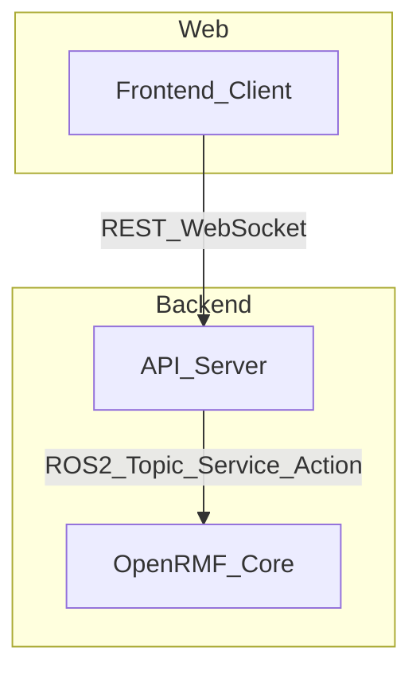

# 🏗️ Architettura

!!! info ""
    Questa sezione offre una panoramica visiva e descrittiva dell’architettura del backend Open-RMF, concentrandosi sull’interazione tra i diversi componenti chiave: **Frontend**, **API Server** e **Open-RMF Core (ROS 2)**.

---

## 📊 Schema architetturale

---

## 🔎 Descrizione high-level

!!! abstract "Come funziona il flusso"
    1. **Frontend**: dashboard web, microservizi o app custom inviano richieste via REST o WebSocket verso l’API Server.
    2. **API Server**: funge da gateway, espone API RESTful e WebSocket e traduce le richieste in chiamate ROS 2 verso Open-RMF.
    3. **Open-RMF Core (ROS 2)**: gestisce flotte, task, risorse (porte, ascensori, robot, ecc.) e tutta la logica di orchestrazione.

---

## 🧩 Componenti principali

**Frontend / Client**

- Dashboard web o microservizi personalizzati
- Comunica solo tramite REST/WebSocket, mai direttamente con ROS 2
- Gestisce autenticazione e autorizzazione lato utente

**API Server**

- Espone endpoint REST e canali WebSocket
- Traduce le richieste web in comunicazioni ROS 2
- Gestisce autenticazione (OIDC/JWT), permessi e ruoli
- Aggiorna i client in tempo reale sugli stati del sistema e dei robot

**Open-RMF Core (ROS 2)**

- Scheduler, fleet adapters, task manager, resource manager, ecc.
- Comunica nativamente tramite ROS 2 (topic, servizi, azioni)
- Può essere eseguito in simulazione o su robot reali

---

## 🔁 Esempio di flusso dati
!!! tip "Caso d’uso: Creazione di un nuovo task"
    1. L’utente crea un task dalla dashboard → richiesta REST POST /tasks all’API Server
    2. L’API Server valida la richiesta, la traduce in una chiamata ROS 2 verso il task manager di Open-RMF
    3. Open-RMF pianifica il task e aggiorna lo stato 
    4. L’API Server riceve gli aggiornamenti e li invia in tempo reale al frontend via WebSocket

---

## 🛠️ Vantaggi di questa architettura
!!! success ""
    - **Disaccoppiamento**: il frontend non interagisce mai direttamente con ROS 2, migliorando sicurezza e scalabilità.
    - **Real-time**: aggiornamenti push tramite WebSocket. 
    - **Scalabilità**: ogni componente può essere containerizzato e scalato separatamente. 
    - **Interoperabilità**: il gateway via REST/WebSocket permette l’integrazione con altri sistemi IT, microservizi, dashboard custom, ecc.

---

## ❓ Domande frequenti
!!! question "Posso collegare più frontend allo stesso backend?"
    Sì, l’architettura supporta più client contemporanei (dashboard, microservizi, sistemi esterni).

!!! question "Il backend può funzionare sia con robot reali sia in simulazione?"
    Sì, Open-RMF è pensato per funzionare indifferentemente in ambiente reale o simulato, senza modifiche architetturali.

!!! question "E se volessi integrare un altro sistema IT (WMS, ERP, ecc.)?"
    Puoi farlo creando microservizi che comunicano via REST/WebSocket con l’API Server.