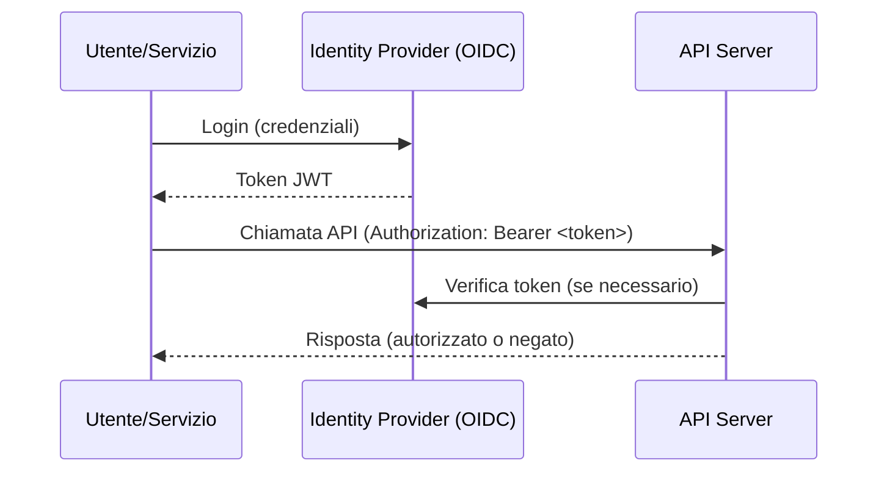

# 🔒 Autenticazione & Sicurezza

!!! info ""
    L’autenticazione e la sicurezza rappresentano pilastri fondamentali nell’architettura del backend Open-RMF.  
    L’API Server si occupa di garantire che solo utenti e servizi autorizzati possano accedere e interagire con le funzionalità esposte.

---

## 🎯 Obiettivi dell’autenticazione

- **Verificare l’identità** degli utenti e dei servizi che accedono alle API.
- **Proteggere i dati** e le funzionalità critiche da accessi non autorizzati.
- **Gestire permessi granulari** tramite ruoli e policy.
- **Tracciare le operazioni** per audit e compliance.

---

## 🏛️ Principi architetturali

!!! abstract ""
    - **Single Point of Authentication**: tutto il traffico verso l’API Server passa attraverso un meccanismo di autenticazione centralizzato.
    - **Standard moderni**: si utilizzano protocolli come OpenID Connect (OIDC) e JSON Web Token (JWT), compatibili con i principali identity provider.
    - **Gestione dei permessi**: ogni utente/servizio è associato a ruoli che definiscono le operazioni consentite.

---

## 🧩 Come funziona nel backend Open-RMF

1. **Autenticazione tramite provider OIDC**  
   L’utente o servizio effettua il login presso un identity provider (es. Keycloak, Auth0, Azure AD) e ottiene un token JWT.
2. **Accesso alle API**  
   Tutte le chiamate REST e WebSocket devono includere il token JWT nell’header di autorizzazione.
3. **Validazione e autorizzazione**  
   L’API Server valida il token, verifica i permessi (ruoli, policy), e consente o nega la richiesta.
4. **Gestione sessione e rinnovo token**  
   In caso di token scaduti o non validi, vengono rifiutate le richieste e, se supportato, può essere attivato un meccanismo di refresh.

---

## 🔐 Ruoli e permessi

!!! tip ""
    - Ogni utente o servizio può essere associato a uno o più ruoli (es. admin, operator, viewer).
    - Le operazioni disponibili (es. creazione task, visualizzazione stato, gestione risorse) dipendono dai permessi associati al ruolo.
    - La mappatura ruoli/permessi è configurabile e può essere integrata con i sistemi di identity aziendali.

---

## 📋 Flusso tipico di autenticazione

---

## 🛡️ Best Practice
!!! success ""
   - Proteggi sempre il traffico con HTTPS/TLS.
   - Configura la scadenza dei token e un meccanismo di refresh sicuro.
   - Limita i permessi solo a ciò che è necessario per ogni ruolo.
   - Traccia tutte le operazioni sensibili per audit e sicurezza.
   - Integra l’autenticazione con l’infrastruttura aziendale quando possibile (SSO, LDAP, ecc.).

---

## ❓ Domande frequenti
!!! question "Cosa succede se il token non è valido o scaduto?"
    L’API Server rifiuta la richiesta con un errore di autenticazione e non esegue nessuna operazione.

!!! question "Posso usare diversi provider OIDC?"
    Sì, l’API Server può essere configurato per supportare diversi provider compatibili con OIDC/JWT.

!!! question "I permessi sono configurabili?"
    Sì, ruoli e permessi sono personalizzabili e possono essere mappati secondo le policy aziendali.

---