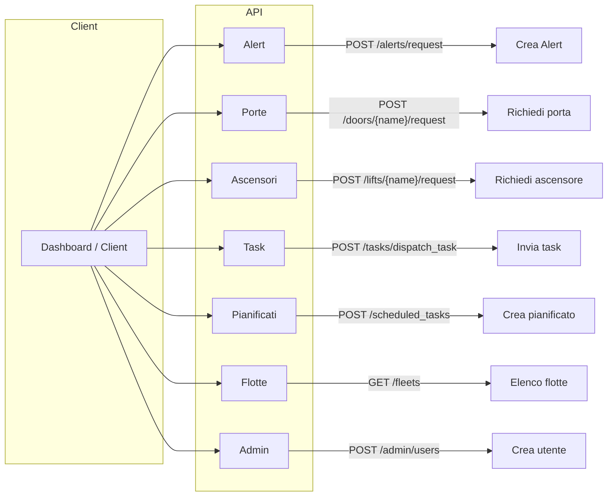

# 🔗 Endpoints

!!! info ""
    Gli **endpoint** rappresentano i punti di accesso offerti dall’API Server per interagire con il backend Open-RMF.  
    Sono progettati per esporre funzionalità in modo standardizzato, sicuro e scalabile sia tramite chiamate sincrone (REST) che aggiornamenti in tempo reale (WebSocket).

---

## 🧭 Tipologie di endpoint

- **REST API**
    - Permettono operazioni sincrone: invio di richieste e ricezione di una risposta immediata.
    - Ideali per operazioni di lettura, scrittura o modifica di risorse (es. flotte, task, robot, porte).

- **WebSocket / Event Streams**
    - Permettono una comunicazione asincrona e bidirezionale.
    - Utilizzate per ricevere aggiornamenti in tempo reale su stati di robot, task, eventi di sistema, ecc.

---

## 🗂️ Struttura degli endpoint REST

!!! abstract "Principali risorse REST"
    - **/fleets**: gestione e interrogazione delle flotte robotiche disponibili.
    - **/robots**: informazioni e stato dei singoli robot.
    - **/tasks**: creazione, aggiornamento e monitoraggio dei task.
    - **/doors**: stato e controllo delle porte automatizzate.
    - **/lifts**: gestione e monitoraggio degli ascensori.
    - **/users**: (se implementato) gestione utenti, ruoli, permessi.

---

## 🌐 Canali WebSocket/Event Streams

!!! abstract "Principali canali WebSocket"
    - **robot_states**: aggiornamenti in tempo reale sullo stato dei robot.
    - **task_states**: evoluzione e stato corrente dei task.
    - **door_states**: stato delle porte in tempo reale.
    - **lift_states**: stato degli ascensori.
    - **event_logs**: eventi e notifiche di sistema.

---

## 🏆 Ruolo degli endpoint nell’architettura

!!! tip ""
    Gli endpoint rappresentano il “contratto” tra il mondo esterno e il backend Open-RMF.  
    Permettono a dashboard, microservizi e sistemi esterni di eseguire operazioni, ricevere informazioni aggiornate e integrarsi in modo sicuro e standardizzato.

---

## 📋 Esempi di operazioni

### 🧭 Panoramica teorica
- Ottenere la lista delle flotte disponibili  
- Creare un nuovo task  
- Recuperare lo stato corrente di un robot  
- Modificare lo stato di una risorsa (es. apertura porta)

---

## 🧩 Reference completo degli Endpoint
Qui sotto trovi **tutti gli endpoint dettagliati** con metodi, path, parametri ed esempi

!!! tip "Quick start"
    - **Base URL**: `http://localhost:8000`  
    - **Live Swagger UI**: [http://localhost:8000/docs](http://localhost:8000/docs)  
    - **OpenAPI JSON**: [http://localhost:8000/openapi.json](http://localhost:8000/openapi.json)

---

## 📊 Schema ad Alto Livello



---

## 🔐 Autenticazione

Tutti gli endpoint (eccetto `/socket.io`) richiedono un token Bearer ottenuto dal tuo IdP OpenID Connect.

```http
Authorization: Bearer <jwt>
```

---

## 📁 Catalogo Endpoint

### 🚨 Alert (`/alerts`)
!!! abstract "Concept"
    Gli **alert** sono notifiche interattive mostrate agli operatori (allarme antincendio, batteria scarica, ecc.).

| Metodo | Percorso | Descrizione | Corpo richiesta |
|--------|----------|-------------|-----------------|
| `POST` | `/alerts/request` | Crea nuovo alert | `AlertRequest` |
| `GET`  | `/alerts/request/{alert_id}` | Leggi singolo alert | — |
| `POST` | `/alerts/request/{alert_id}/respond` | Rispondi a un alert | `{"response": "ack"}` |
| `GET`  | `/alerts/requests/task/{task_id}` | Alert relativi a un task | — |
| `GET`  | `/alerts/unresponded_requests` | Alert ancora da rispondere | — |

??? example "Example – Crea un alert"
    ```bash
    curl -X POST http://localhost:8000/alerts/request \
      -H "Authorization: Bearer $TOKEN" \
      -H "Content-Type: application/json" \
      -d '{
        "title": "Fuoco al piano 1",
        "message": "Evacuazione immediata",
        "tier": "critical",
        "display": true
      }'
    ```

---

### 🚪 Porte – Doors (`/doors`)

| Metodo | Percorso | Descrizione | Corpo |
|--------|----------|-------------|-------|
| `GET`  | `/doors` | Elenca tutte le porte | — |
| `GET`  | `/doors/{name}/state` | Stato attuale di una porta | — |
| `POST` | `/doors/{name}/request` | Apri / Chiudi | `{"mode": 2}` |

??? info "Modalità porta"
    | Valore | Significato |
    |--------|-------------|
    | `0`    | Chiusa      |
    | `1`    | In movimento |
    | `2`    | Aperta      |

---

### 🛗 Ascensori – Lifts (`/lifts`)

| Metodo | Percorso | Descrizione | Corpo |
|--------|----------|-------------|-------|
| `GET`  | `/lifts` | Elenca ascensori | — |
| `GET`  | `/lifts/{name}/state` | Stato + piano attuale | — |
| `POST` | `/lifts/{name}/request` | Chiama / sposta ascensore | `LiftRequest` |

---

### 📝 Task (`/tasks`)

| Metodo | Percorso | Descrizione | Corpo |
|--------|----------|-------------|-------|
| `POST` | `/tasks/dispatch_task` | Invia nuovo task | `DispatchTaskRequest` |
| `POST` | `/tasks/cancel_task` | Annulla task in corso | `{"task_id": "uuid"}` |
| `GET`  | `/tasks/requests` | Lista delle richieste task | — |
| `GET`  | `/tasks/{task_id}/state` | Stato di un singolo task | — |
| `GET`  | `/tasks/{task_id}/log` | Log eventi del task | — |

---

### 📅 Task pianificati – Scheduled Tasks (`/scheduled_tasks`)

| Metodo | Percorso | Descrizione | Corpo |
|--------|----------|-------------|-------|
| `POST` | `/scheduled_tasks` | Crea task ricorrente | `ScheduledTaskRequest` |
| `GET`  | `/scheduled_tasks` | Lista task pianificati | — |
| `GET`  | `/scheduled_tasks/{id}` | Dettaglio singola pianificazione | — |
| `DELETE` | `/scheduled_tasks/{id}` | Elimina pianificazione | — |

---

### 🚛 Flotte e robot – Fleets (`/fleets`)

| Metodo | Percorso | Descrizione |
|--------|----------|-------------|
| `GET`  | `/fleets` | Tutte le flotte e i robot |
| `GET`  | `/fleets/{name}/state` | Stato flotta (robot, batteria, problemi…) |
| `POST` | `/fleets/{name}/decommission` | Metti robot fuori servizio |
| `POST` | `/fleets/{name}/recommission` | Riporta robot in servizio |

---

### ⚙️ Amministrazione – Admin (`/admin`)

!!! danger "Richiede ruolo admin"

| Metodo | Percorso | Descrizione |
|--------|----------|-------------|
| `GET`  | `/admin/users` | Elenca utenti |
| `POST` | `/admin/users` | Crea utente |
| `PUT`  | `/admin/users/{u}/roles` | Sostituisci ruoli |
| `POST` | `/admin/roles` | Crea ruolo |
| `POST` | `/admin/roles/{r}/permissions` | Aggiungi permesso |

---

## 📦 Schemi comuni

### `AlertRequest`
```json
{
  "title": "string",
  "message": "string",
  "tier": "info | warning | critical",
  "display": true,
  "responses_available": ["ack", "ignore"]
}
```

### `DispatchTaskRequest`
```json
{
  "category": "patrol",
  "description": {"zone": "L1_corridor"},
  "fleet_name": "tinyRobot",
  "priority": {"type": "binary", "value": 1},
  "requester": "dashboard"
}
```

### `LiftRequest`
```json
{
  "request_type": 1,
  "destination": "L2",
  "door_mode": 0
}
```

### `ScheduledTaskRequest`
```json
{
  "task_request": { /* stesso di DispatchTaskRequest */ },
  "schedules": [
    { "every": 1, "period": "day", "at": "09:00" }
  ],
  "start_from": "2025-07-30T09:00:00Z",
  "until": "2025-12-31"
}
```

---

## 🧪 Script di prova rapida

Salva come `test_api.sh`, inserisci il tuo `$TOKEN`.

```bash
#!/usr/bin/env bash
HOST="http://localhost:8000"
TOKEN="IL_TUO_JWT"

# Lista flotte
curl -sS -H "Authorization: Bearer $TOKEN" $HOST/fleets | jq .

# Invia task di prova
curl -sS -H "Authorization: Bearer $TOKEN" \
     -H "Content-Type: application/json" \
     -d '{"category":"patrol","description":{"zone":"corridoio_L1"},"fleet_name":"tinyRobot"}' \
     $HOST/tasks/dispatch_task | jq .
```

---

## 🔒 Sicurezza degli endpoint

!!! warning ""
    Tutti gli endpoint sono protetti tramite autenticazione (es. JWT/OIDC) e autorizzazione basata su ruoli e permessi.  
    L’accesso a specifici endpoint o canali può essere limitato in base al profilo utente.

---

## ❓ Domande frequenti

!!! question "Posso estendere o personalizzare gli endpoint?"
    Sì, l’API Server può essere configurato o esteso per offrire endpoint aggiuntivi o personalizzati.

!!! question "Come vengono versionati gli endpoint?"
    È buona pratica includere la versione nell’URL (es. `/v1/fleets`), facilitando l’evoluzione senza rompere la retrocompatibilità.

!!! question "Come funzionano le sottoscrizioni agli eventi?"
    Di norma, il client si connette via WebSocket e si sottoscrive ai canali di interesse, ricevendo aggiornamenti dal server in tempo reale.

---